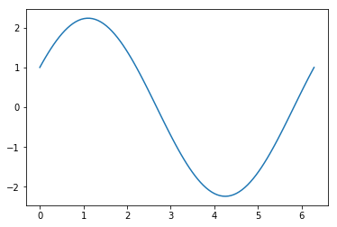

Parameter estimation for a linear operator using Gaussian processes
-------------------------------------------------------------------

Assumptions about the linear operator:

:math:`\mathcal{L}_x^\phi u(x) = f(x)`

:math:`u(x) \sim \mathcal{GP}(0, k_{uu}(x,x',\theta))`

:math:`f(x) \sim \mathcal{GP}(0, k_{ff}(x,x',\theta,\phi))`

:math:`y_u = u(X_u) + \epsilon_u; \epsilon_u \sim \mathcal{N}(0, \sigma_u^2I)`

:math:`y_f = f(X_f) + \epsilon_f; \epsilon_f \sim \mathcal{N}(0, \sigma_f^2I)`

Taking a simple operator as example:

:math:`\mathcal{L}_x^\phi := \phi \cdot + \frac{d}{dx}\cdot`

:math:`u(x) = sin(x)`

:math:`f(x) = \phi sin(x) + cos(x)`

Problem at hand:

Given :math:`\{X_u, y_u\}` and :math:`\{X_f, y_f\}`, estimate
:math:`\phi`.

step 1: simulate data
^^^^^^^^^^^^^^^^^^^^^

Use :math:`\phi = 2`

.. code:: ipython3

    import numpy as np
    import sympy as sp
    from scipy.optimize import minimize
    import matplotlib.pyplot as plt

.. code:: ipython3

    x_u = np.linspace(0,2*np.pi,10)
    y_u = np.sin(x_u)
    x_f = np.linspace(0,2*np.pi, 10)
    y_f = 2.0*np.sin(x_f) + np.cos(x_f)

.. code:: ipython3

    plt.plot(x_u,y_u)
    plt.show()

.. image:: output_3_0.png

.. code:: ipython3

    x1 = np.linspace(0,2*np.pi,100)
    y1 = 2.0*np.sin(x1) + np.cos(x1)
    plt.plot(x1,y1)
    plt.show()

.. image:: output_4_0.png

step 2: create covariance matrix
^^^^^^^^^^^^^^^^^^^^^^^^^^^^^^^^

This step uses information about :math:`\mathcal{L}_x^\phi` but not
about :math:`u(x)` or :math:`f(x)`.

:math:`k_{uu}(x_i, x_j; \theta) = \theta exp(-\frac{1}{2}(x_i-x_j)^2)`

.. code:: ipython3

    x_i, x_j, theta, phi = sp.symbols('x_i x_j theta phi')
    kuu_sym = theta*sp.exp(-1/(2)*((x_i - x_j)**2))
    kuu_fn = sp.lambdify((x_i, x_j, theta), kuu_sym, "numpy")
    def kuu(x, theta):
        k = np.zeros((x.size, x.size))
        for i in range(x.size):
            for j in range(x.size):
                k[i,j] = kuu_fn(x[i], x[j], theta)
        return k

$k_{ff}(x_i,x_j;:raw-latex:`\theta`,:raw-latex:`\phi`) \\ =
:raw-latex:`\mathcal{L}`\ *{x_i}^:raw-latex:`\phi `:raw-latex:`\mathcal{L}`*\ {x_j}^:raw-latex:`\phi `k_{uu}(x_i,
x_j; :raw-latex:`\theta`) \\ =
:raw-latex:`\mathcal{L}`\ *{x_i}^:raw-latex:`\phi `:raw-latex:`\left`(
:raw-latex:`\phi `k*\ {uu} +
:raw-latex:`\frac{\partial}{\partial x_j}`k_{uu} :raw-latex:`\right`) \\
= :raw-latex:`\phi`^2 k_{uu} +
:raw-latex:`\phi `:raw-latex:`\frac{\partial}{\partial x_j}`k_{uu} +
:raw-latex:`\phi `:raw-latex:`\frac{\partial}{\partial x_i}`k_{uu} +
:raw-latex:`\frac{\partial}{\partial x_i}`:raw-latex:`\frac{\partial}{\partial x_j}`k_{uu}\\
$

More explicit calculations follow:

:math:`= \mathcal{L}_{x_i}^\phi \mathcal{L}_{x_j}^\phi \left( \theta exp(-\frac{1}{2}(x_i-x_j)^2) \right] \\ = \mathcal{L}_{x_i}^\phi \left[ \theta exp(-\frac{1}{2}(x_i-x_j)^2)\left(\phi + (-\frac{1}{2})2(x_i-x_j)(-1) \right) \right] \\ = \mathcal{L}_{x_i}^\phi \left[\theta exp(-\frac{1}{2}(x_i-x_j)^2)(\phi + x_i - x_j) \right] \\ = \phi \theta exp(-\frac{1}{2}(x_i-x_j)^2)(\phi+x_i-x_j) + \theta exp(-\frac{1}{2}(x_i-x_j)^2)\left[ -\frac{1}{2}2(x_i-x_j)(\phi+x_i-x_j) + 1 \right] \\ = \theta exp(-\frac{1}{2}(x_i-x_j)^2)\left[ \phi^2 - (x_i-x_j)^2 + 1 \right]`

.. code:: ipython3

    kff_sym = phi**2*kuu_sym + phi*sp.diff(kuu_sym, x_j) + phi*sp.diff(kuu_sym, x_i) + sp.diff(kuu_sym, x_j, x_i)
    kff_fn = sp.lambdify((x_i, x_j, theta, phi), kff_sym, "numpy")
    def kff(x, theta, phi):
        k = np.zeros((x.size, x.size))
        for i in range(x.size):
            for j in range(x.size):
                k[i,j] = kff_fn(x[i], x[j], theta, phi)
        return k

:math:`k_{fu}(x_i,x_j;\theta,\phi) \\ = \mathcal{L}_{x_i}^\phi k_{uu}(x_i, x_j; \theta) \\ = \phi k_{uu} + \frac{\partial}{\partial x_i}k_{uu} \\ = \mathcal{L}_{x_i}^\phi \left[ \theta exp(-\frac{1}{2}(x_i-x_j)^2) \right] \\ = \theta exp(-\frac{1}{2}(x_i-x_j)^2) \left[ (-\frac{1}{2})2(x_i-x_j) + \phi \right] \\ = \theta exp(-\frac{1}{2}(x_i-x_j)^2)(\phi-x_i+x_j)`

.. code:: ipython3

    kfu_sym = phi*kuu_sym + sp.diff(kuu_sym, x_i)
    kfu_fn = sp.lambdify((x_i, x_j, theta, phi), kfu_sym, "numpy")
    def kfu(x1, x2, theta, phi):
        k = np.zeros((x1.size, x2.size))
        for i in range(x1.size):
            for j in range(x2.size):
                k[i,j] = kfu_fn(x1[i], x2[j], theta, phi)
        return k

:math:`k_{uf}(x_i,x_j;\theta,\phi) \\ = \mathcal{L}_{x_j}^\phi k_{uu}(x_i, x_j; \theta) \\ = \mathcal{L}_{x_j}^\phi \left[ \theta exp(-\frac{1}{2}(x_i-x_j)^2) \right] \\ = \theta exp(-\frac{1}{2}(x_i-x_j)^2) \left[ (-\frac{1}{2})2(x_i-x_j)(-1) + \phi \right]\\ = \theta exp(-\frac{1}{2}(x_i-x_j)^2)(\phi+x_i-x_j)`

.. code:: ipython3

    def kuf(x1, x2, theta, phi):
        return kfu(x1,x2,theta,phi).T

step 3: define negative log marginal likelihood
^^^^^^^^^^^^^^^^^^^^^^^^^^^^^^^^^^^^^^^^^^^^^^^

:math:`K = \begin{bmatrix} k_{uu}(X_u, X_u; \theta) + \sigma_u^2I & k_{uf}(X_u, X_f; \theta, \phi) \\ k_{fu}(X_f, X_u; \theta, \phi) & k_{ff}(X_f, X_f; \theta, \phi) + \sigma_f^2I \end{bmatrix}`

For simplicity, assume :math:`\sigma_u = \sigma_f`.

:math:`\mathcal{NLML} = \frac{1}{2} \left[ log|K| + y^TK^{-1}y + Nlog(2\pi) \right]`

where :math:`y = \begin{bmatrix} y_u \\ y_f \end{bmatrix}`

.. code:: ipython3

    def nlml(params, x1, x2, y1, y2, s):
        K = np.block([
            [kuu(x1, params[0]) + s*np.identity(x1.size), kuf(x1, x2, params[0], params[1])],
            [kfu(x1, x2, params[0], params[1]), kff(x2, params[0], params[1]) + s*np.identity(x2.size)]
        ])
        y = np.concatenate((y1, y2))
        val = 0.5*(np.log(abs(np.linalg.det(K))) + np.mat(y) * np.linalg.inv(K) * np.mat(y).T)
        return val.item(0)

.. code:: ipython3

    nlml((1, 2), x_u, x_f, y_u, y_f, 1e-6)

.. parsed-literal::

    -49.506869382523455

step 4: optimise hyperparameters
^^^^^^^^^^^^^^^^^^^^^^^^^^^^^^^^

.. code:: ipython3

    minimize(nlml, np.random.rand(2), args=(x_u, x_f, y_u, y_f, 1e-6), method="Nelder-Mead")

.. parsed-literal::

     final_simplex: (array([[0.2339862 , 2.00000114],
           [0.23400558, 2.00000344],
           [0.23389067, 2.00000342]]), array([-54.80042016, -54.80042014, -54.80042004]))
               fun: -54.80042016441411
           message: 'Optimization terminated successfully.'
              nfev: 98
               nit: 52
            status: 0
           success: True
                 x: array([0.2339862 , 2.00000114])

Using pyGPs (Arthur’s Idea)
~~~~~~~~~~~~~~~~~~~~~~~~~~~

.. code:: ipython3

    import pyGPs
    model_u = pyGPs.GPR()
    model_u.setData(x_u, y_u)
    model_u.optimize(x_u, y_u)
    
    model_f = pyGPs.GPR()
    model_f.setData(x_f, y_f)
    model_f.optimize(x_f, y_f)

.. parsed-literal::

    Number of line searches 14
    Number of line searches 40

.. code:: ipython3

    print(np.exp(model_f.covfunc.hyp))
    print(np.exp(model_u.covfunc.hyp))

.. parsed-literal::

    [3.01008812 7.20765418]
    [3.05519677 3.43110287]

.. code:: ipython3

    s_u = np.exp(model_u.covfunc.hyp[1])
    l_u = np.exp(model_u.covfunc.hyp[0])
    s_f = np.exp(model_f.covfunc.hyp[1])
    phi = ((s_f/s_u)**2 - 1/l_u**2)**0.5
    phi

.. parsed-literal::

    2.075025301252897

.. code:: ipython3

    x_p = np.linspace(0,2*np.pi,100)
    y_p = model_f.predict(x_p)
    # plot predictions
    plt.plot(x_p,y_p[0])
    plt.show()

